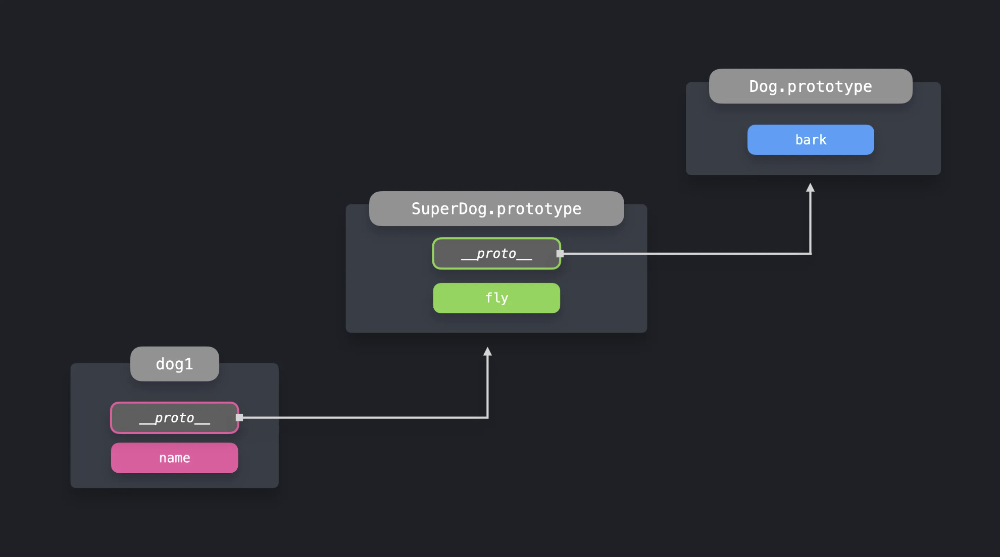

## Prototype 패턴이란?
- 동일 타입의 여러 객체들이 프로퍼티를 공유할 때 유용하게 사용하는 패턴
- 프로토타입은 자바스크립트 객체의 기본 속성이며, 프로토타입 체인을 활용하여 **메모리를 절약**하고 중복을 줄일 수 있다

## 기본 구현

### ES6 클래스
- 클래스의 메서드는 자동으로 프로토타입에 추가된다
- 클래스 필드는 각 인스턴스에 추가된다. (ex. name)

```javascript
class Dog {
  constructor(name) {
    this.name = name
  }

  bark() {
    return `Woof!`
  }
}

const dog1 = new Dog('Daisy')
const dog2 = new Dog('Max')
const dog3 = new Dog('Spot')
```

### 프로토타입 객체 확인
- 생성자의 `prototype` 프로퍼티 또는 인스턴스의 `__proto__`를 통해 확인할 수 있다

```javascript
console.log(Dog.prototype)
// constructor: ƒ Dog(name) bark: ƒ bark()

console.log(dog1.__proto__)
// constructor: ƒ Dog(name) bark: ƒ bark()
```

💡 역자 주: __proto__ 는 비 표준이다. Object.getPrototypeOf(dog1)는 표준이므로 이를 사용한다.


## 프로토타입 체인
- 객체에 없는 프로퍼티에 접근하면, 자바스크립트는 프로퍼티가 나타날 때까지 프로토타입 체인을 거슬러 올라간다

### 프로토타입에 동적으로 프로퍼티 추가
- 인스턴스 생성 후에도 프로토타입에 새로운 프로퍼티를 추가할 수 있다

```javascript
Dog.prototype.play = function() {
  return `Playing!`
}

dog1.play() // Playing!
```

### 상속을 통한 프로토타입 체인 확장

```javascript
class SuperDog extends Dog {
  constructor(name) {
    super(name)
  }

  fly() {
    return 'Flying!'
  }
}

const superDog = new SuperDog('Daisy')
superDog.bark() // Woof! (Dog의 메서드 - 프로토타입 체인으로 접근)
superDog.fly()  // Flying! (SuperDog의 메서드)
```

- `SuperDog`의 프로토타입의 `__proto__`는 `Dog.prototype`을 가리키므로, 프로토타입 체인을 따라 `bark` 메서드에 접근할 수 있다



## Object.create
- 프로토타입으로 쓰일 객체를 인자로 받아 새로운 객체를 만들어낸다
- 클래스 없이도 프로토타입 상속을 구현할 수 있다

```javascript
const dog = {
  bark() {
    return `Woof!`
  },
}

const pet1 = Object.create(dog)
pet1.bark() // Woof!
console.log(Object.keys(pet1)); // []
console.log(Object.keys(pet1.__proto__)); // ["bark"]
```

- `pet1`은 자체 프로퍼티가 없지만, 프로토타입 체인을 통해 `dog`의 메서드에 접근할 수 있다

## 장점
- **메모리 효율성**: 메서드를 중복 생성하지 않고 프로토타입에서 공유한다
- **동적 확장**: 인스턴스 생성 후에도 프로토타입에 새로운 기능을 추가할 수 있다
- **코드 재사용성**: 상속을 통해 기존 기능을 확장하고 재사용할 수 있다

## 주의사항
- 프로토타입 체인이 깊어지면 프로퍼티 조회 시 성능이 저하될 수 있다
- 프로토타입 오염(prototype pollution)으로 인해 예상치 못한 동작이 발생할 수 있다
