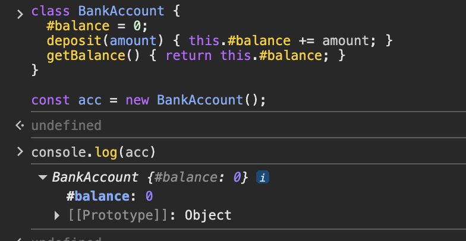

## Factory 패턴이란?
- `new` 키워드를 사용하지 않고, **함수 호출**만으로 객체를 생성하는 패턴
- 동일한 프로퍼티를 가진 여러 객체를 효율적으로 만들어낼 수 있다

## Factory 패턴 구현

### 기본 형태
- 팩토리 함수는 매번 새로운 객체를 반환한다
- ES6 화살표 함수로 간결하게 구현 가능

```javascript
const createUser = ({ firstName, lastName, email }) => ({
  firstName,
  lastName,
  email,
  fullName() {
    return `${this.firstName} ${this.lastName}`;
  },
});

const user1 = createUser({
  firstName: 'John',
  lastName: 'Doe',
  email: 'john@doe.com',
});

const user2 = createUser({
  firstName: 'Jane',
  lastName: 'Doe',
  email: 'jane@doe.com',
});

console.log(user1.fullName()); // "John Doe"
console.log(user2.fullName()); // "Jane Doe"
```

### 동적 키-값 객체 생성
- 배열이나 동적 데이터를 기반으로 객체를 생성할 때 유용하다

```javascript
const createObjectFromArray = ([key, value]) => ({
  [key]: value,
});

createObjectFromArray(['name', 'John']); // { name: "John" }
```

## 클래스와 다른점?
### 1. 클로저를 활용해 진짜 Private 변수를 만들 수 있다

```javascript
// 클래스: #private은 문법적 private
class BankAccount {
  #balance = 0;
  deposit(amount) { this.#balance += amount; }
  getBalance() { return this.#balance; }
}

const acc = new BankAccount();
acc.#balance; // ❌ SyntaxError (접근 불가)
// 하지만 devtools에서 보임.

// 팩토리: 클로저 private은 진짜로 외부에서 접근할 방법이 없음
const createBankAccount = () => {
  let balance = 0; // 스코프 밖에서는 절대 접근 불가

  return {
    deposit: (amount) => { balance += amount; },
    getBalance: () => balance,
  };
};

const acc2 = createBankAccount();
acc2.balance; // undefined — 프로퍼티 자체가 없음
// devtools에서도 안 보임, 우회 방법 없음
```

### 2. 클래스와 다르게 this 바인딩 문제가 없다

#### 클래스의 this 문제
- 클래스 메서드를 변수에 꺼내거나 콜백으로 넘기면 `this`가 사라진다

```javascript
class User {
  constructor(name) {
    this.name = name;
  }
  greet() {
    return `안녕, ${this.name}`;
  }
}

const user = new User('선민');

// 메서드를 변수에 꺼내면 this가 사라짐
const greetFn = user.greet;
greetFn(); // ❌ this가 undefined가 되어 TypeError발생

// 콜백으로 넘겨도 마찬가지
setTimeout(user.greet, 100); // ❌ this가 undefined가 되어 TypeError발생

// bind로 해결해야 함
setTimeout(user.greet.bind(user), 100); // ✅
```

#### 팩토리는 this가 필요 없음
- 클로저가 `name` 값을 직접 잡고 있기 때문에, `this`가 뭐든 상관없다

```javascript
const createUser = ({ firstName, lastName, email }) => ({
  firstName,
  lastName,
  email,
  fullName() {
    return `${firstName} ${lastName}`;
  },
});

const user1 = createUser({
  firstName: 'John',
  lastName: 'Doe',
  email: 'john@doe.com',
});

const userFn = user1.fullName;
console.log(userFn()); // ✅ 'John Doe'
```

### 3. 클래스를 사용하는 것이 **메모리 효율성** 측면에서 더 낫다
객체를 1000개 만들면:
- 클래스: 프로퍼티 1000개 + 메서드 1개 (prototype에 공유)
- 팩토리: 프로퍼티 1000개 + 메서드 1000개 (각각 새로 생성)
```javascript
// 클래스: prototype으로 메서드 공유 (메모리 효율적)
class User {
  constructor(firstName, lastName, email) {
    this.firstName = firstName;
    this.lastName = lastName;
    this.email = email;
  }

  fullName() {
    return `${this.firstName} ${this.lastName}`;
  }
}

// 팩토리: 매번 새로운 fullName 함수가 생성됨
const createUser = ({ firstName, lastName, email }) => ({
  firstName,
  lastName,
  email,
  fullName() {
    return `${this.firstName} ${this.lastName}`;
  },
});
```

## Factory 패턴 예시

### 설정에 따른 객체 생성
- 환경(개발/운영)이나 역할(관리자/일반)에 따라 다른 설정의 객체를 생성

```javascript
const createLogger = (env) => {
  const isDev = env === 'development';
  return {
    log(message) {
      if (isDev) console.log(`[DEV] ${message}`);
    },
    error(message) {
      console.error(`[ERROR] ${message}`);
    },
    getLevel() {
      return isDev ? 'debug' : 'error';
    },
  };
};

const logger = createLogger(process.env.NODE_ENV);
logger.log('디버그 메시지'); // 개발 환경에서만 출력
```

### 복잡한 초기화 로직 캡슐화

```javascript
const createFetcher = ({ baseURL, timeout = 5000, headers = {} }) => {
  // 복잡한 초기화 로직을 숨김
  const defaultHeaders = {
    'Content-Type': 'application/json',
    ...headers,
  };

  const controller = new AbortController();

  return {
    async get(path) {
      const res = await fetch(`${baseURL}${path}`, {
        headers: defaultHeaders,
        signal: controller.signal,
        timeout,
      });
      return res.json();
    },
    async post(path, body) {
      const res = await fetch(`${baseURL}${path}`, {
        method: 'POST',
        headers: defaultHeaders,
        body: JSON.stringify(body),
        signal: controller.signal,
      });
      return res.json();
    },
    cancel() {
      controller.abort();
    },
  };
};

// 사용하는 쪽은 내부 설정을 몰라도 됨
const api = createFetcher({
  baseURL: 'https://api.example.com',
  headers: { Authorization: 'Bearer token123' },
});

api.get('/users');
api.post('/users', { name: '선민' });
```
