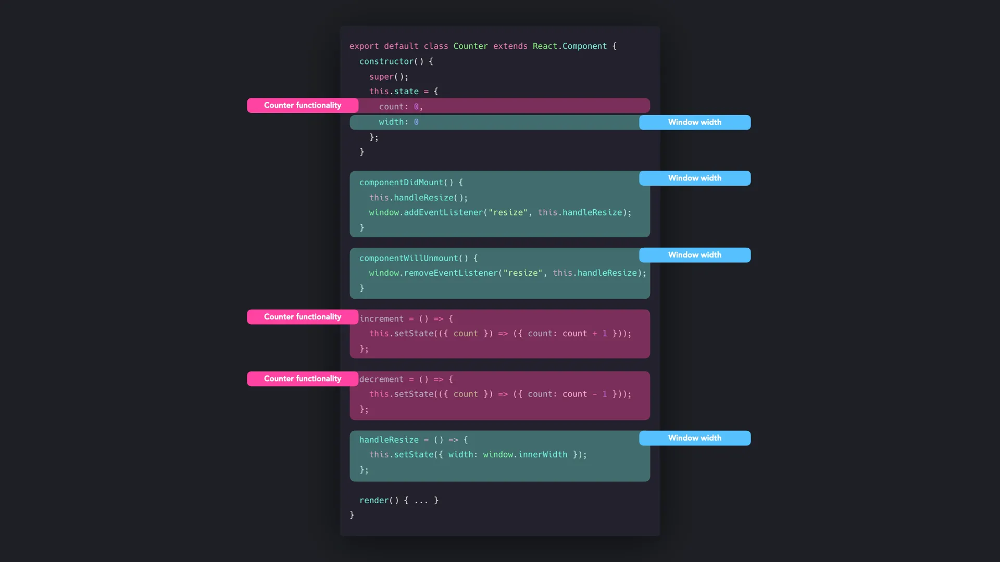

## Hook 패턴이란?

- React 16.8에서 도입된 기능으로, **클래스 없이 함수형 컴포넌트에서 상태와 생명주기 기능을 사용**할 수 있게 한다
- 기존 클래스 컴포넌트의 복잡성(this 바인딩, 생명주기 메서드 분산 등)을 해결한다
- HOC나 Render Props 없이도 **컴포넌트 간 상태 로직을 재사용**할 수 있다

## 클래스 컴포넌트의 문제점

### 1. ES2015 클래스 학습 비용

함수형 컴포넌트에서 상태나 생명주기가 필요해지면 클래스로 재작성해야 했다. 이는 클래스 문법, `this` 바인딩 등 추가 개념의 이해를 요구한다.
```javascript
class Input extends React.Component {
  constructor() {
    super()
    this.state = { input: '' }

    // 여기서 만약 this 바인딩을 안하면
    this.handleInput = this.handleInput.bind(this)
  }

  handleInput(e) {
    // this === undefined → TypeError 발생!
    this.setState({ input: e.target.value })
  }

  render() {
    return <input onChange={handleInput} value={this.state.input} />
  }
}
```

### 2. Wrapper Hell

코드 공유를 위해 HOC나 Render Props를 도입하면 구조 재설계가 필요하고, 컴포넌트 트리가 깊어진다.

```javascript
<Wrapper1>
  <Wrapper2>
    <Wrapper3>
      <Component />
    </Wrapper3>
  </Wrapper2>
</Wrapper1>
```

### 3. 로직의 분산

생명주기 메서드에 로직이 산재되어 관련 코드가 분리된다. 예를 들어 resize 이벤트 처리가 `componentDidMount`와 `componentWillUnmount`에 나뉘어 관리된다.


```javascript
componentDidUpdate (prevProps, prevState) {
    // 포커스 지정
		if(prevProps.downloadEula !== this.props.downloadEula && this.props.downloadEula !== 'loading' && !Spotlight.getCurrent()) {
			Spotlight.focus('eula_next_btn');
		}

    // 인터넷 미연결
		if (prevProps.internet !== this.props.internet && !this.props.internet && !this.state.networkErrorPopupOpen) {
			this.setState({
        networkErrorPopupOpen: true,
      })
		}

    // 인터넷은 연결되었으나 약관 다운로드 실패시
		if (prevProps.downloadEula !== this.props.downloadEula && this.props.downloadEula === 'fail' && !this.state.failedPopupOpen && this.props.internet) {
			this.setState({
        failedPopupOpen: true,
      });
		}
	}
```

`useEffect`로 변환하면 관심사별로 분리된다.

```javascript
// 포커스 지정 — 매 렌더 후 실행
useEffect(() => {
  if (downloadEula !== "loading" && !Spotlight.getCurrent()) {
    Spotlight.focus('eula_next_btn')
  }
}, [downloadEula])

// 인터넷 미연결 — internet이 바뀔 때만 실행
useEffect(() => {
  if (!internet && !networkErrorPopupOpen) {
    setNetworkErrorPopupOpen(true)
  }
}, [internet])

// 약관 다운로드 실패 — downloadEula가 바뀔 때만 실행
useEffect(() => {
  if (downloadEula === 'fail' && !failedPopupOpen && internet) {
    setFailedPopupOpen(true)
  }
}, [downloadEula])
```

- `componentDidUpdate`에서는 `prevProps`와 직접 비교해야 했지만, `useEffect`는 deps 배열이 변경 감지를 대신하므로 코드가 단순해진다
- 서로 무관한 로직이 하나의 메서드에 뭉쳐 있던 것을 **기능 단위로 분리**할 수 있다

## 기본 Hooks

### State Hook (useState)

함수형 컴포넌트에 상태를 추가한다. 클래스의 `this.state`와 `this.setState()`를 대체한다.

```javascript
function Input() {
  const [input, setInput] = useState('')

  return (
    <input
      onChange={e => setInput(e.target.value)}
      value={input}
      placeholder="Type something..."
    />
  )
}
```

### Effect Hook (useEffect)

생명주기 메서드(`componentDidMount`, `componentDidUpdate`, `componentWillUnmount`)를 대체한다.

```javascript
function WindowSize() {
  const [width, setWidth] = useState(window.innerWidth)

  useEffect(() => {
    const handleResize = () => setWidth(window.innerWidth)
    window.addEventListener('resize', handleResize)

    // cleanup — componentWillUnmount 역할
    return () => window.removeEventListener('resize', handleResize)
  }, []) // 빈 배열 — 마운트 시에만 실행
}
```

| 의존 배열 | 실행 시점 |
|---|---|
| 없음 | 매 렌더링마다 실행 |
| `[]` (빈 배열) | 마운트 시에만 실행 (componentDidMount) |
| `[value]` | value가 변경될 때 실행 |
| 반환 함수 | 언마운트 시 정리 작업 (componentWillUnmount) |

## Custom Hooks

재사용 가능한 상태 로직을 함수로 추출한다. `use` 접두사를 붙이는 것이 네이밍 관례다.

```javascript
function useKeyPress(targetKey) {
  const [keyPressed, setKeyPressed] = useState(false)

  function downHandler({ key }) {
    if (key === targetKey) setKeyPressed(true)
  }

  function upHandler({ key }) {
    if (key === targetKey) setKeyPressed(false)
  }

  useEffect(() => {
    window.addEventListener('keydown', downHandler)
    window.addEventListener('keyup', upHandler)

    return () => {
      window.removeEventListener('keydown', downHandler)
      window.removeEventListener('keyup', upHandler)
    }
  }, [])

  return keyPressed
}
```

여러 컴포넌트에서 동일한 키보드 이벤트 로직을 재사용할 수 있다.

```javascript
function App() {
  const happy = useKeyPress('h')
  const sad = useKeyPress('s')

  return (
    <div>
      <div>h pressed: {happy && '😊'}</div>
      <div>s pressed: {sad && '😢'}</div>
    </div>
  )
}
```

## 추가 Hooks

### useContext

Context API와 연동하여 prop drilling 없이 데이터를 공유한다.

```javascript
const ThemeContext = React.createContext()

function ThemeProvider({ children }) {
  const [theme, setTheme] = useState('dark')
  return (
    <ThemeContext.Provider value={{ theme, setTheme }}>
      {children}
    </ThemeContext.Provider>
  )
}

// prop drilling 없이 어디서든 테마에 접근
function ThemedButton() {
  const { theme, setTheme } = useContext(ThemeContext)
  return <button onClick={() => setTheme('light')}>{theme}</button>
}
```

### useReducer

복잡한 상태 로직 관리에 적합하다. Redux와 유사한 패턴을 컴포넌트 수준에서 사용할 수 있다.

```javascript
// useState로 관리하면 loading/data/error를 서로 독립적인 상태로 관리 필요
// useReducer로 묶으면 상태 전이를 명시적으로 제어할 수 있다
const initialState = { loading: false, data: null, error: null }

function reducer(state, action) {
  switch (action.type) {
    case 'FETCH_START':   return { loading: true,  data: null,        error: null }
    case 'FETCH_SUCCESS': return { loading: false, data: action.data,  error: null }
    case 'FETCH_ERROR':   return { loading: false, data: null,        error: action.error }
    default: throw new Error(`Unknown action: ${action.type}`)
  }
}

function UserProfile({ userId }) {
  const [state, dispatch] = useReducer(reducer, initialState)

  useEffect(() => {
    dispatch({ type: 'FETCH_START' })
    fetch(`/api/users/${userId}`)
      .then(res => res.json())
      .then(data => dispatch({ type: 'FETCH_SUCCESS', data }))
      .catch(error => dispatch({ type: 'FETCH_ERROR', error: error.message }))
  }, [userId])

  if (state.loading) return <div>Loading...</div>
  if (state.error)   return <div>에러: {state.error}</div>
  return <div>{state.data?.name}</div>
}
```

- `useState`였다면 `setLoading(true)`, `setData(null)`, `setError(null)` 3개를 동시에 호출해야 하고, 하나라도 빠트리면 `loading: true`이면서 `error`가 남아있는 불가능한 상태가 된다

## Hooks vs 클래스 비교

| | Hooks | 클래스 |
|---|---|---|
| 계층 구조 | 컴포넌트 트리 변화 없음 | HOC/Render Props로 깊어짐 |
| 코드량 | 보일러플레이트 적음 | 상대적으로 많음 |
| 로직 분류 | 기능별로 분류 가능 | 생명주기 메서드별로 분산 |
| 재사용 | Custom Hook으로 간단히 추출 | HOC/Render Props 필요 |
| this 바인딩 | 불필요 | 필수 (혼란 유발) |

## 장점

- **간결한 코드**: 클래스 대비 보일러플레이트가 줄어든다
- **기능별 로직 분류**: 생명주기에 얽히지 않고 관련 로직을 한곳에 모을 수 있다
- **재사용성**: 상태 로직을 Custom Hook으로 추출하여 HOC/Render Props의 복잡성 없이 공유한다
- **Wrapper Hell 해소**: 컴포넌트 트리가 깊어지지 않는다

## 단점 (주의할 점)

- **Rules of Hooks 준수 필요**: 최상위에서만 호출, 함수형 컴포넌트 또는 Custom Hook 내에서만 사용 등의 규칙을 지켜야 한다
- **학습 곡선**: `useEffect`의 의존 배열, 클로저 등 올바른 사용법을 숙지해야 한다
- **오용 가능성**: `useCallback`, `useMemo` 등 최적화 훅을 불필요한 곳에 남용할 수 있다

## 참고자료

- https://patterns-dev-kr.github.io/design-patterns/hooks-pattern/
