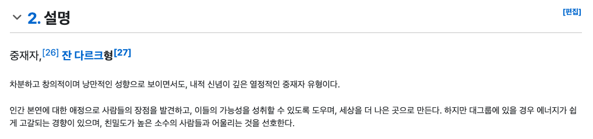

# 중재자 패턴
- 컴포넌트들이 서로 직접 통신하는 대신 중재자 역할을 하는 객체를 통하도록 합니다.
  - 중재자 객체가 요청을 받아 이를 필요로 하는 객체들에게 전달하는 것 입니다.
  - 중재자는 보통 객체나 함수로 구현됩니다.
- "공항에서 비행기의 동선을 관리하는 관제소" 에 비유할 수 있습니다.
  - 비행기끼리 직접 통신하면 사고로 이어질 수 있겠지만, 관제소에서 상황을 전달받아 통제를 하게 되면 서로 충돌없이 안전하게 활주로를 이용할 수 있게 됩니다.
- 객체까리 서로 통신하게 하여 N:N 의 관계를 이루게 하는 대신 객체의 요청들을 모두 중재자 객체에게 보냅니다.
  - 중재자는 이런 요청들을 처리하여 이를 필요로 하는 객체에게 전달합니다.
  - before
  
  - after
  

## 예제
- 실무에서 중재자 패턴이 적합한 곳은 채팅을 구현할때 입니다.
  - 채팅앱에서 사용자는 메세지를 직접 서로 주고받지 않습니다.
  - 그 대신 채팅 서버에 메세지를 전송하고 서버가 각 사용자에게 메세지를 전달하는 형태입니다.
  ```ts
  class ChatRoom {
    logMessage(user, message) {
      const time = new Date()
      const sender = user.getName()

      console.log(`${time} [${sender}]: ${message}`)
    }
  }

  class User {
    constructor(name, chatroom) {
      this.name = name
      this.chatroom = chatroom
    }

    getName() {
      return this.name
    }

    send(message) {
      this.chatroom.logMessage(this, message)
    }
  }
  ```
  - 위의 예제에서 사용자는 ChatRoom과 연결되는 User를 만들어낼 수 있고. 각 인스턴스는 send메서드를 통해 다른 사용자에게 메시지를 전송할 수 있습니다.

---

# 추가 보충
- 중재자 패턴은 "INFP"입니다.
  
- 객체 간의 복잡한 상호작용을 중재자 객체가 관리하도록 하는 디자인 패턴
  - 컴포넌트들이 서로 직접 통신하지 않고 중재자를 통해 통신함으로써 결합도를 낮추고 유지보수성을 높임.

## 프론트엔드 아이디어
1. 컴포넌트 간 통신 간소화: 부모-자식간의 prop drilling 문제 해결
2. 복잡한 상태 관리 단순화: 여러 컴포넌트가 공유하는 상태를 중앙에서 관리
3. 결합도 감소: 컴포넌트들이 서로를 직접 참조하지 않아도 됨

## 커스텀 훅을 이용한 구현
```tsx
const useMediator = () => {
  const [components, setComponents] = useState({});
  const [events, setEvents] = useState({});

  // 컴포넌트 등록
  const register = (componentName, callbacks) => {
    setComponents(prev => ({
      ...prev,
      [componentName]: callbacks
    }));
  };

  // 이벤트 발행
  const publish = (eventName, data) => {
    if (events[eventName]) {
      events[eventName].forEach(callback => callback(data));
    }
  };

  // 이벤트 구독
  const subscribe = (eventName, callback) => {
    setEvents(prev => ({
      ...prev,
      [eventName]: [...(prev[eventName] || []), callback]
    }));

    // 구독 해제 함수 반환
    return () => {
      setEvents(prev => ({
        ...prev,
        [eventName]: prev[eventName].filter(cb => cb !== callback)
      }));
    };
  };

  return { register, publish, subscribe };
};

// Mediator Context 생성
const MediatorContext = createContext();

// Mediator Provider
const MediatorProvider = ({ children }) => {
  const mediator = useMediator();
  return (
    <MediatorContext.Provider value={mediator}>
      {children}
    </MediatorContext.Provider>
  );
};

// 사용 예시: 검색 컴포넌트
const SearchBar = () => {
  const { publish } = useContext(MediatorContext);
  const [query, setQuery] = useState('');

  const handleSearch = () => {
    publish('search', query);
  };

  return (
    <div>
      <input
        value={query}
        onChange={(e) => setQuery(e.target.value)}
      />
      <button onClick={handleSearch}>Search</button>
    </div>
  );
};

// 사용 예시: 검색 결과 컴포넌트
const SearchResults = () => {
  const [results, setResults] = useState([]);
  const { subscribe } = useContext(MediatorContext);

  useEffect(() => {
    const unsubscribe = subscribe('search', async (query) => {
      const response = await fetch(`/api/search?q=${query}`);
      const data = await response.json();
      setResults(data);
    });
    return unsubscribe;
  }, [subscribe]);

  return (
    <ul>
      {results.map(item => (
        <li key={item.id}>{item.name}</li>
      ))}
    </ul>
  );
};

// 앱에 적용
const App = () => (
  <MediatorProvider>
    <SearchBar />
    <SearchResults />
  </MediatorProvider>
);
```

## 중재자 패턴의 장점
1. 결합도 감소: 컴포넌트들이 서로 직접 참조하지 않음
2. 통제 집중화: 시스템의 상호작용 로직이 한 곳에 집중됨
3. 유지보수성 향상: 상호작용 로직 변경이 용이
4. 재사용성 증가: 개별 컴포넌트가 독립적으로 작동 가능

## 주의 사항
1. 중재자의 과도한 책임: 중재자가 너무 많은 로직을 가지지 않도록 주의
  - 인프피를 너무 힘들게 하지 말자.
2. 성능 고려: 너무 많은 컴포넌트가 중재자에 의존하면 성능 저하 가능성
3. 적절한 사용 시나리오: 간단한 컴포넌트 통신에는 오버엔지니어링일 수 있음