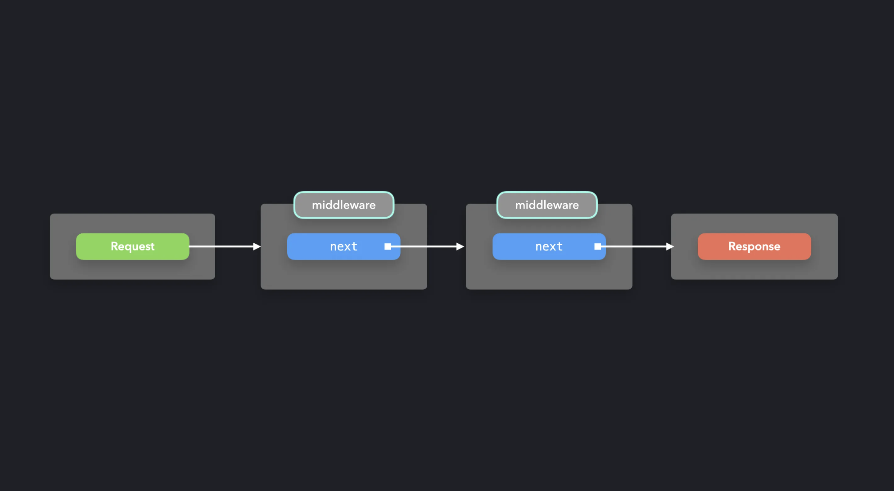

## Mediator/Middleware 패턴이란?

- **컴포넌트들이 서로 직접 통신하는 대신, 중재자(Mediator)를 통해 통신하도록 하는 패턴**
- 객체 간의 다대다(M:N) 통신을 중앙 집중화하여 복잡도를 줄인다
- 공항 관제소처럼, 각 비행기(컴포넌트)가 서로 직접 통신하지 않고 관제소(Mediator)를 통해 소통한다
- Pub/Sub에서 Event Channel이 중재자 역할을 하는 것도 Mediator 패턴의 일종이다

## 구성 요소

| 요소 | 역할 |
|---|---|
| `Mediator` | 모든 통신을 중재하는 중앙 객체 |
| `Colleague` | Mediator를 통해 통신하는 개별 객체들 |

## 기본 구현

```javascript
class ChatRoom {
  logMessage(user, message) {
    const time = new Date()
    const sender = user.getName()
    console.log(`${time} [${sender}]: ${message}`)
  }
}

class User {
  constructor(name, chatroom) {
    this.name = name
    this.chatroom = chatroom  // Mediator를 주입받음
  }

  getName() {
    return this.name
  }

  send(message) {
    this.chatroom.logMessage(this, message)  // 직접 통신하지 않고 Mediator에게 위임
  }
}
```

- `User`끼리 직접 참조하지 않는다
- 메시지 전송은 항상 `ChatRoom`(Mediator)을 통해 이루어진다
- `ChatRoom`이 통신 흐름 전체를 제어한다

## 실제 사용 예시
### Express.js 미들웨어

Express의 미들웨어 체인이 Mediator 패턴의 대표적인 예다.

```javascript
const app = require('express')()

// 미들웨어1: 헤더 추가
app.use('/', (req, res, next) => {
  req.headers['test-header'] = 1234
  next()  // 다음 미들웨어로 전달
})

// 미들웨어2: 헤더 확인
app.use('/', (req, res, next) => {
  console.log(`Request has test header: ${!!req.headers['test-header']}`)
  next()
})
```

- 각 미들웨어는 `req`, `res`를 직접 주고받지 않는다
- Express가 중재자로서 `next()`를 통해 요청을 순서대로 미들웨어에 전달한다
- 미들웨어끼리는 서로의 존재를 모른다


```
Request ──> 미들웨어1 ──next()──> 미들웨어2 ──next()──> 라우터
              ↑                       ↑
           (Colleague)            (Colleague)
                    Express (Mediator)가 흐름 제어
```

## Pub/Sub 패턴

Pub/Sub 패턴에서 Event Channel이 Mediator 역할을 한다.

```
Observer 패턴:   Subject ────────────> Observer
                  (직접 참조, Mediator 없음)

Pub/Sub 패턴:    Publisher ──> Event Channel ──> Subscriber
                               (= Mediator)
```

| 패턴 | Mediator 유무 | 특징 |
|---|---|---|
| Observer | 없음 | Subject가 Observer를 직접 관리 |
| Pub/Sub | 있음 (Event Channel) | Publisher·Subscriber가 서로 모름 |
| Mediator | 있음 | Colleague들이 서로 모름 |

### Pub/Sub 패턴 코드

Event Channel이 **이벤트 이름(토픽)** 별로 Subscriber를 관리한다.

```javascript
class EventChannel {
  constructor() {
    this.events = {}
  }

  subscribe(event, callback) {
    if (!this.events[event]) {
      this.events[event] = []
    }
    this.events[event].push(callback)
  }

  unsubscribe(event, callback) {
    if (!this.events[event]) return
    this.events[event] = this.events[event].filter(cb => cb !== callback)
  }

  publish(event, data) {
    if (!this.events[event]) return
    // 해당 이벤트를 구독한 Subscriber에게만 전달
    this.events[event].forEach(callback => callback(data))
  }
}

const channel = new EventChannel()

// Subscriber는 관심 있는 이벤트만 구독
channel.subscribe('user:login', (data) => {
  console.log(`로그인 알림: ${data.name}`)
})

channel.subscribe('user:logout', (data) => {
  console.log(`로그아웃 알림: ${data.name}`)
})

channel.subscribe('user:login', (data) => {
  console.log(`로그인 로깅: ${data.name} at ${Date.now()}`)
})

// Publisher는 Subscriber가 누구인지 모른 채 이벤트를 발행
channel.publish('user:login', { name: '선민' })
// 로그인 알림: 선민
// 로그인 로깅: 선민 at 1713004800000

channel.publish('user:logout', { name: '선민' })
// 로그아웃 알림: 선민
```

- Publisher(`publish` 호출부)는 누가 구독하고 있는지 전혀 모른다
- Subscriber는 누가 이벤트를 발행했는지 전혀 모른다
- **이벤트 이름(토픽)** 을 기준으로 메시지가 필터링된다


### 상태 관리 라이브러리에서의 패턴

실제 상태 관리 라이브러리들도 순수한 한 패턴이 아니라 여러 패턴이 혼합된 형태다.

**Redux — Provider + Pub/Sub**

```javascript
// Provider 패턴 — Context로 store를 주입
<Provider store={store}>
  <App />
</Provider>

// Pub/Sub — action(토픽)을 dispatch하면, 해당 상태를 구독한 컴포넌트만 리렌더링
dispatch({ type: 'counter/increment' })  // publish
useSelector(state => state.counter)       // subscribe (특정 상태 토픽 구독)
```

- `dispatch`하는 쪽은 누가 구독하는지 모르고, `useSelector`하는 쪽은 누가 dispatch하는지 모른다
- 중간에 store가 중재자 역할을 하므로 Pub/Sub에 해당한다

**Recoil / Jotai — Provider + Observer**

```javascript
// Recoil — atom을 직접 참조하여 구독
const counterAtom = atom({ key: 'counter', default: 0 })
const [count, setCount] = useRecoilState(counterAtom)

// Jotai — 마찬가지로 atom을 직접 참조
const counterAtom = atom(0)
const [count, setCount] = useAtom(counterAtom)
```

- 컴포넌트가 atom(Subject)을 직접 참조해야 구독할 수 있다 (Observer적 결합)
- action/dispatch 같은 중재자 없이 atom에 직접 읽기/쓰기한다
- 다만 atom별로 구독자를 따로 관리하므로 토픽 필터링 특성은 있다
- Recoil은 `RecoilRoot`(Provider)가 필수이고, Jotai는 Provider 없이도 동작 가능하다

**Zustand — Pub/Sub만**

```javascript
// Provider 불필요 — 모듈 레벨에서 store 생성
const useStore = create((set) => ({
  count: 0,
  increment: () => set((state) => ({ count: state.count + 1 })),
}))

// subscribe: selector로 관심 있는 상태만 구독
const count = useStore((state) => state.count)
// publish: publisher는 누가 구독하는지 모름.
const increment = useStore((state) => state.increment)
```

- Provider 없이 모듈에서 직접 store를 생성하고, selector를 통해 필요한 상태만 구독한다
- store가 중재자 역할을 하며, 컴포넌트는 store의 내부 구현을 알 필요 없다

**비교 정리**

| 라이브러리 | 패턴 구성 | 상태 구독 방식 | Provider 필요 여부 |
|---|---|---|---|
| **Redux** | Provider + Pub/Sub | action(토픽) dispatch로 디커플링 | O |
| **Recoil** | Provider + Observer | atom을 직접 참조하여 구독 | O (`RecoilRoot`) |
| **Jotai** | Observer | atom을 직접 참조하여 구독 | X (선택적) |
| **Zustand** | Pub/Sub | selector로 관심 상태만 구독 | X |

### Pub/Sub과 Observer의 차이
- 중재자가 없으면(Observer) → 코드가 단순하고 직관적, 대신 atom이 바뀌면 그 atom을 import한 모든 곳을 찾아야 함 (상태를 사용한곳과 setState한 곳 모두 수정 필요)
  ```javascript
  const counterAtom = atom('0')
  const [count, setCount] = useAtom(counterAtom)

  // 여기서 counterAtom의 타입이 string으로 바뀐다면?
  setCount('3')
  ```
- 중재자가 있으면(Pub/Sub) → Publisher·Subscriber가 완전히 분리되어 서로 모르니 결합도 낮음, 대신 publisher → event channel → data 흐름을 따라가야 해서 추적 비용이 있음
  ```javascript
  const useStore = create((set) => ({
    count: '0',
    increment: () => set((state) => ({ count: String(state.count + 1) })),
  }))

  // increment사용하는 쪽은 수정 필요 없음
  const increment = useStore((state) => state.increment)
  increment()
  ```


## 장점

- **결합도 감소**: 컴포넌트들이 서로를 직접 참조하지 않는다
- **단일 제어 지점**: 통신 흐름을 Mediator 한 곳에서 관리할 수 있다
- **유연한 확장**: 새로운 Colleague를 추가해도 기존 컴포넌트를 수정할 필요가 없다
- **관심사의 분리**: 각 컴포넌트는 자신의 역할만 수행하고, 통신은 Mediator에 위임한다

## 단점

- **God Object 위험**: 모든 통신이 집중되면 Mediator가 지나치게 복잡해질 수 있다
- **단일 장애점**: Mediator에 버그가 생기면 전체 통신이 영향을 받는다
- **데이터 추적이 어려움**: 흐름이 Mediator를 통하므로 직접 통신보다 추적이 복잡할 수 있다 (이거는 Mediator에만 로그를 찍어봐도 디버깅이 가능하기 때문에 장점이자 단점)

## 참고자료

- https://patterns-dev-kr.github.io/design-patterns/mediator-middleware-pattern/
