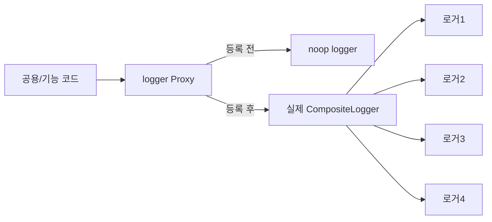
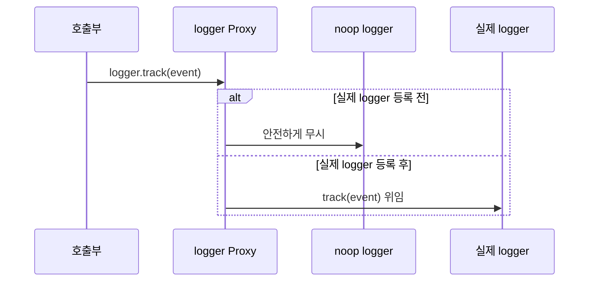
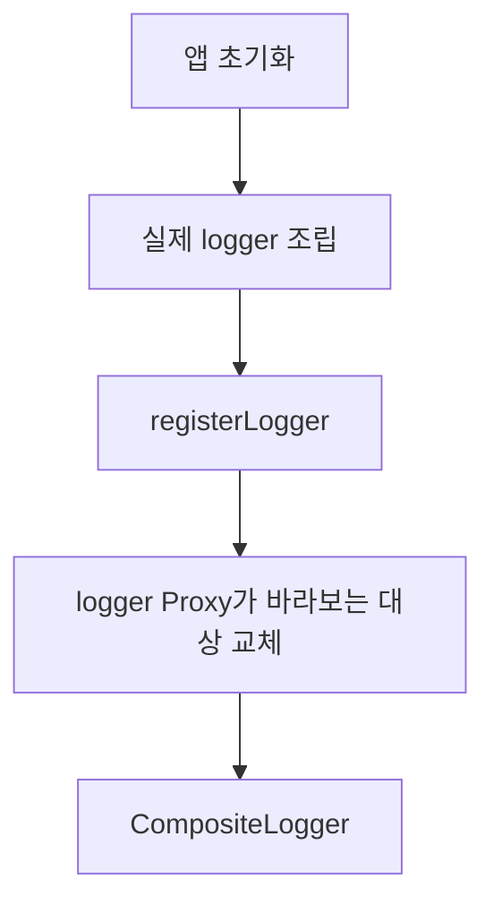
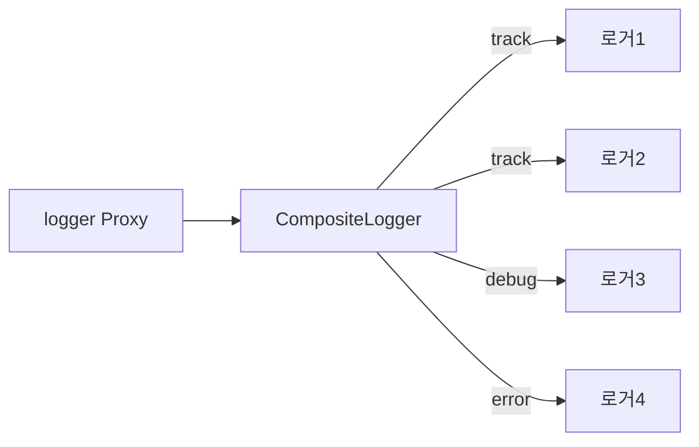

# Proxy 패턴

진짜 객체에 바로 접근하지 않고, 그 앞에 대리 객체를 세워 접근 제어하는 패턴

⇒ 호출자는 실제 객체를 직접 호출한다고 생각하지만, 중간에 프록시가 있음

```tsx
client → proxy → realObject
```

프록시는 단순히 데이터 전달하는 용도를 넘어서.. 구조 설계에 따라  접근 권한, 캐싱, 로깅, 지연 로딩, API 요청 제어, 네트워크 요청 대리, 객체 하이딩등 다양하게 사용이 가능하다!

### 철학

대상 객체에 대한 접근 자체를 하나의 제어 지점으로 만든다

### 구조

```tsx
interface Subject {
  request(): void;
}

class RealSubject implements Subject { // 진짜 객체
  request() {
    console.log("실제 객체의 요청 처리");
  }
}

class ProxySubject implements Subject { // 프록시 객체 
  private realSubject: RealSubject;

  constructor() {
    this.realSubject = new RealSubject();
  }

  request() {
    console.log("프록시: 요청 전 처리");
    this.realSubject.request();
    console.log("프록시: 요청 후 처리");
  }
}
```

사용자의 요청은 proxySubject() 를 통해서 이뤄짐 

```tsx
const subject: Subject = new ProxySubject();
subject.request();
```

중요한 포인트는 proxy와 RealSubject 모두 동일한 인터페이스를 가진다는 점!
그래야 호출하는 시점에서는 사용법이 같다

## 프록시 패턴을 사용하는 이유

### **직접 접근하기 위험한 기능**

관리자만 호출해야 하는 기능의 경우, 아무데서나 호출하면 매우 위험! 그래서 안전망이 필요 ⇒ 프록시

```tsx
class AdminService {
  deleteUser(userId: string) {
    console.log(`${userId} 삭제`);
  }
}

class AdminServiceProxy {
  constructor(
    private adminService: AdminService,
    private currentUser: User
  ) {}

  deleteUser(userId: string) {
    if (this.currentUser.role !== "admin") {
      throw new Error("권한이 없습니다.");
    }

    this.adminService.deleteUser(userId);
  }
}
```

어드민 서비스를 사용하기 위히서는 프록시를 경유해야함 ⇒ 이러한 경우 “보호 프록시”

### 객체 생성 비용이 클 때

처음부터 객체를 만들면 비효율적 .. ex ) 대용량 이미지나 지도, 차트, 에디터나 뷰어

```tsx
class HeavyChart {
  constructor() {
    console.log("차트 라이브러리 초기화...");
  }

  render() {
    console.log("차트 렌더링");
  }
}

class ChartProxy {
  private chart: HeavyChart | null = null;

  render() {
    if (!this.chart) {
      this.chart = new HeavyChart();
    }

    this.chart.render();
  }
}
```

프록시를 두어서, 실제 사용 시점까지 생성을 미룰 수 있다! ⇒ “가상 프록시”

```tsx
const HeavyComponent = lazy(() => import("./HeavyComponent"));
```

리액트의 lazy나 넥스트의 dynamic import 도 넓은 의미에서 지연 접근을 대리하는 프록시적 사고이다! 

### 3. API 요청을 직접 보내지 않고 제어 할 때

```tsx
fetch("/api/users");
```

단순 패치만 보내는 경우, 그 권한 처리 ( 토큰, 에러, 로딩, 재시도 .. ) 등을 각 호출부마다 해야함.. 지옥!

```tsx
class ApiClient {
  async get<T>(url: string): Promise<T> {
    const response = await fetch(url, {
      headers: {
        Authorization: `Bearer ${getToken()}`,
      },
    });

    if (!response.ok) {
      throw new Error("API Error");
    }

    return response.json();
  }
}
```

컴포넌트는 실제 페치를 모른다.. 하지만 페치가 들어왔을때 권한을 처리하는 역할을 수행 ⇒ 원겨 프록시 

### 4. 캐싱을 해서 불필요한 호출을 막을 때

```tsx
class UserServiceProxy {
  private cache = new Map<string, User>();

  constructor(private userService: UserService) {}

  async getUser(id: string) {
    if (this.cache.has(id)) {
      return this.cache.get(id);
    }

    const user = await this.userService.getUser(id);
    this.cache.set(id, user);
    return user;
  }
}
```

> 같은 요청이면 굳이 또 가지 말자..  ⇒ 캐시 프록시
> 

리액트 쿼리나, SWR 같은 서버 상태 관리 라이브러리들이 해당하는 개념을 차용 

## 일반적으로 자주 만나는 프록시

### 개발 서버 프록시

CORS를 만나면서 한번은 꼭 설정해봤던 vite, cra 프록시 우회 

```tsx
server: {
  proxy: {
    "/api": "http://localhost:8080"
  }
}
```

⇒ 프록시 디자인 패턴과는 결이 살짝 다르지만, 원격 RemoteProxy 클라이언트-서버 간, 개발 서버가 중간에서 요청 대리, 철학이 일치!

### JS에서의 Proxy 문법

```tsx
const user = {
  name: "창우",
  age: 28,
};

const proxyUser = new Proxy(user, {
  get(target, prop) {
    console.log(`${String(prop)}에 접근`);
    return target[prop as keyof typeof target];
  },

  set(target, prop, value) {
    console.log(`${String(prop)} 변경: ${value}`);
    target[prop as keyof typeof target] = value;
    return true;
  },
});
```

js에서의 proxy 문법도 있음.. 

```tsx
console.log(proxyUser.name);
proxyUser.age = 29;
```

접근하면, 해당 접근을 가로챔 

### 공부 중 의문

감싼다 개념 ⇒ 데코레이터랑 무슨 차이?

**의도가 다르다!**

- 프록시 : 접근 제어가 핵심! 이 객체에 접근해도 될까? 언제 접근할 것인가?
- 데코레이터 : 기능 확장이 핵심! 기존 동작에 기능을 덧 붙이자

### 프록시 패턴 트레이드 오프

장점

- 명확한 관심사 분리! ⇒ 실제 객체는 본질적인 일만 수행, 프록시 객체는 접근 제어 역할을 수행

단점

- 프록시 남발하면 구조 복잡, 디버깅이 어려워짐

⇒ 접근을 제어할 명확한 이유가 있을 떄 채택하는것이 좋은 패턴 

# 로거 통합 사례로 보는 Proxy 패턴

## 1. 이 사례에서의 핵심 문제

분산되어 있는 로거 현황

| 앱 | 실제 조립되는 로거 예시 |
| --- | --- |
| 앱1 | 로거1 + 로거2 + 로거3 + 로거4 |
| 앱2 | 로거1 + 로거2 + 로거4 |
| 앱3 | 로거1 + 로거4 |

즉, 호출부는 `logger` 하나만 알고 싶지만 실제 객체는 앱 초기화 이후에야 결정된다.

이때 직접 접근 구조를 쓰면 문제가 생긴다.

| 직접 접근 시 문제 | 영향 |
| --- | --- |
| 공용 코드가 앱별 로거 조합을 알아야 함 | 공용 코드와 앱 코드가 강하게 결합됨 |
| 로거 초기화 전에 호출될 수 있음 | 런타임 오류 또는 로그 유실 가능 |
| 앱마다 SDK 초기화 방식이 다름 | 호출부가 SDK 세부사항에 오염됨 |
| 로거 교체/추가 시 호출부 수정 가능성 | 변경 범위가 커짐 |

## 2. 해결 아이디어: 실제 로거 앞에 Proxy를 세운다

프록시 패턴의 핵심은 **진짜 객체에 바로 접근하지 않고, 중간 대리 객체를 통해 접근을 제어하는 것**이다.

이번 구조에서는 공용 `logger`가 바로 그 Proxy 역할을 한다.



호출자는 실제 로거를 직접 쓰는 것처럼 보인다.

```tsx
logger.track('button_click');
```

하지만 내부 흐름은 다르다.

```tsx
client code
→ logger Proxy
→ 등록된 실제 logger 확인
→ CompositeLogger.track()
→ 로거1, 로거2 등으로 위임
```

## 3. 실제 구조를 단순화하면

실제 코드는 더 복잡하지만, 의미만 보면 다음과 같다.

```tsx
let instance: CompositeLogger | null = null;
export function registerLogger(logger: CompositeLogger) {
  instance = logger;
}
export const logger = new Proxy({} as CompositeLogger, {
  get(_, prop) {
    const target = instance ?? noopLogger;
    const value = target[prop];
    return typeof value === 'function'
      ? value.bind(target)
      : value;
  },
});
```

여기서 중요한 점은 호출부가 `logger.track()`을 호출할 때 실제로는 Proxy의 `get`이 먼저 실행된다는 것이다.



## 4. 이 Proxy가 제어하는 것

일반적인 프록시가 접근 권한, 캐싱, 지연 로딩 등을 제어하듯이, 이 사례의 Proxy는 **로거 접근 시점과 실제 대상 객체를 제어**한다.

| Proxy의 제어 지점 | 설명 |
| --- | --- |
| 실제 객체 선택 | 등록된 logger가 있으면 실제 객체로, 없으면 noop logger로 연결 |
| 초기화 순서 보호 | 앱 초기화 전에 호출되어도 바로 터지지 않음 |
| 호출부 은닉 | 호출부는 앱1/앱2/앱3의 로거 조합을 몰라도 됨 |
| 인터페이스 유지 | 기존처럼 `logger.track()`, `logger.captureError()`로 사용 가능 |
| 위임 경로 단일화 | 모든 로거 접근이 Proxy를 거쳐 디버깅 포인트가 명확해짐 |

## 5. 어떤 종류의 Proxy에 가까운가?

이 구조는 한 가지 프록시 유형으로만 딱 떨어지기보다는, 실무형 Proxy에 가깝다.

| 프록시 성격 | 이 사례에서의 의미 |
| --- | --- |
| Virtual Proxy | 실제 logger가 등록되기 전까지 접근을 대리 |
| Protection Proxy | 등록 전 호출을 런타임 오류 대신 noop으로 안전 처리 |
| Smart Proxy | 호출 시점에 대상 선택, 함수 바인딩, fallback 처리를 수행 |

> 전역 logger 접근을 안전하게 중계하는 Proxy 구조

## 6. Register는 Proxy에 실제 객체를 연결하는 장치

Proxy만 있으면 실제 객체가 무엇인지 알 수 없다.

그래서 앱 초기화 시점에 `registerLogger()`로 실제 logger를 연결한다.

```tsx
const logger = new CompositeLogger({
  loggers: [logger1, logger2, logger3, logger4],
});
registerLogger(logger);
```



즉, `registerLogger()`는 **Proxy가 위임할 진짜 객체를 나중에 꽂아주는 연결 지점**이다.

## 7. Composite는 Proxy 뒤의 실제 객체 구조

프록시가 접근을 제어한다면, Composite는 실제 요청을 여러 로거로 분배한다.



역할을 나누면 다음과 같다.

| 구조 | 책임 |
| --- | --- |
| Proxy | 실제 logger에 접근해도 되는지, 어떤 객체로 보낼지 결정 |
| Register | 앱에서 만든 실제 logger를 Proxy에 연결 |
| Composite | 하나의 logger 호출을 여러 leaf logger로 분배 |
| Adapter | 각 SDK의 다른 API를 공통 Logger 인터페이스로 맞춤 |

## 8. 이 구조로 얻은 성과

| 성과 | 구체적인 의미 |
| --- | --- |
| 호출부 단순화 | 기능 코드는 `logger` 하나만 사용 |
| 결합도 감소 | 공용 코드는 앱별 SDK 조합을 모름 |
| 초기화 안정성 향상 | 등록 전 호출도 noop으로 안전 처리 |
| 변경 범위 축소 | 로거 추가/교체는 앱 조립부와 adapter 중심으로 처리 |
| 디버깅 지점 명확화 | 모든 접근이 Proxy를 지나므로 로거 접근 흐름 추적이 쉬움 |

## 요약

로거 통합에서 Proxy는 단순 전달자가 아니라, **공용 코드와 실제 앱별 로거 사이의 접근 제어 지점**이었다.

> 호출부는 항상 같은 `logger`를 사용하지만,

> Proxy가 초기화 여부를 확인하고, 실제 등록된 logger로 안전하게 위임한다.

이 덕분에 로거 초기화 순서, 앱별 SDK 조합, 호출부 변경 문제를 한 곳에서 제어할 수 있었다.
